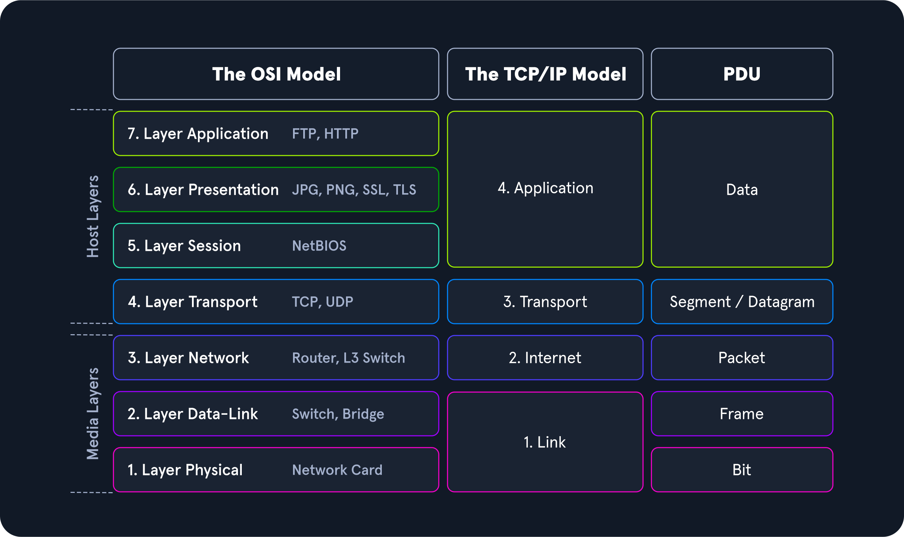
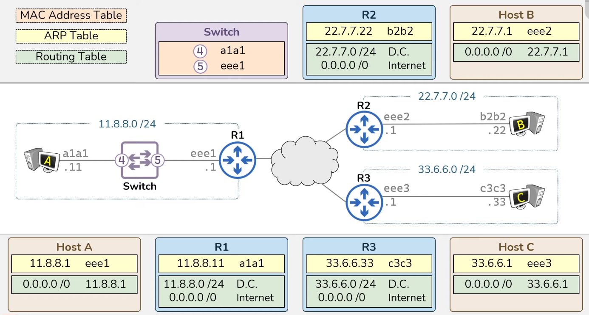

# NetPractice

A comprehensive guide to understanding networking fundamentals for the 42 School NetPractice project.

## Table of Contents
- [Introduction](#introduction)
- [Core Networking Concepts](#core-networking-concepts)
  - [Network Devices](#network-devices)
  - [IP Addressing](#ip-addressing)
  - [Private vs Public IP Addresses](#private-vs-public-ip-addresses)
  - [Subnetting](#subnetting)
  - [OSI Model](#osi-model)
  - [TCP/IP Model](#tcpip-model)
- [Network Components](#network-components)
  - [Switches and Switching](#switches-and-switching)
  - [Routers and Routing](#routers-and-routing)
  - [Network Address Translation (NAT)](#network-address-translation-nat)
- [Network Topologies](#network-topologies)
- [Protocols](#protocols)
  - [Common Protocols](#common-protocols)
  - [Protocol Data Units (PDUs)](#protocol-data-units-pdus)
- [Special IP Address Ranges](#special-ip-address-ranges)
- [MAC Addresses and ARP](#mac-addresses-and-arp)
- [Web Communication Process](#web-communication-process)
- [Summary](#summary)

## Introduction

NetPractice is a 42 School project designed to help you understand the fundamentals of TCP/IP addressing and network configuration. This guide covers essential networking concepts that will help you complete the exercises and gain a solid foundation in networking.

## Core Networking Concepts

### Network Devices

Each device on a network plays a specific role in the transmission of data:

| Node Type | Function |
|:----------|:---------|
| End Devices | Generate, send, and receive data |
| Routers | Route data between networks |
| Switches | Forward data within a LAN based on MAC addresses |
| Hubs | Broadcast data to all devices in a LAN (obsolete) |
| Access Points | Provide wireless connectivity |
| Firewalls | Filter and secure network traffic |
| Servers | Provide services or resources to clients |
| Gateways | Connect networks with different protocols |
| NICs | Provide physical network connectivity |
| Modems | Convert digital data to analog signals for transmission |
| Bridges | Connect and filter traffic between network segments |
| Repeaters | Amplify and retransmit signals to extend network range |
| Proxies | Act as intermediaries for client-server communication |
| Load Balancers | Distribute traffic across multiple servers for optimal performance |

#### Hosts
Hosts are any devices that send or receive network traffic, including:
- Computers, laptops, phones
- IoT (Internet of Things) devices like smart TVs, speakers, watches

**Client-Server Model**:
- **Clients**: Initiate requests
- **Servers**: Respond to requests (computers with specialized software)
- **Host**: Any system connected to the network (could be client or server)

### IP Addressing

- Each host needs an IP address to send/receive data
- IPv4 uses 32 bits (4 bytes) with each segment ranging from 0 to 255 (e.g., 192.168.1.1)
- IPv6 uses 128 bits to address the limitation of IPv4 addresses
- IP addresses identify a device's network interface, not the device itself

### Private vs Public IP Addresses

Due to the limited number of IPv4 addresses (approximately 4 billion), the concept of public and private addresses was created:

1. The router receives a public IP from the Internet Service Provider (ISP)
2. The router assigns private IP addresses to devices on the local network
3. Network Address Translation (NAT) allows multiple devices to share a single public IP

### Subnetting

- **Subnetting** is the process of dividing a large network into smaller, more manageable subnetworks
- **Subnet** is a logical segment of a network that uses IP addresses with the same network address
- **Subnet mask** defines which part of an IP address belongs to the network and which part identifies the device
  - Example: 255.255.255.0 means the first 3 bytes (24 bits) identify the network, and the last byte identifies the host
  - Written as a prefix length: /24

**CIDR** (Classless Inter-Domain Routing) is a method of representation that replaces the fixed assignment between IPv4 address and network classes (A, B, C, D, E). It allows for more flexible division of IP address space.

### OSI Model

The OSI (Open Systems Interconnection) model divides networking into 7 layers, each with specific functions:

#### Layer 1 - Physical
- Handles raw bit transmission over physical media
- Includes cables, Wi-Fi, repeaters, and hubs

#### Layer 2 - Data Link
- Groups bits into frames
- Uses MAC (Media Access Control) addressing
- Includes Network Interface Cards (NICs) and switches
- Provides **hop-to-hop delivery**

#### Layer 3 - Network
- Uses IP addressing scheme
- Includes routers and any device with an IP address
- Provides **end-to-end delivery**

#### Layer 4 - Transport
- Manages service-to-service communication
- Uses port addressing (0-65535 for TCP and UDP)
- Ensures the right service receives the right data

#### Layers 5-7
- **Layer 5 (Session)**: Manages sessions between applications
- **Layer 6 (Presentation)**: Handles data translation and encryption
- **Layer 7 (Application)**: Application-specific protocols (HTTP, FTP, etc.)

### TCP/IP Model

The TCP/IP model is a concise version of the OSI model that contains four layers:

1. **Network Interface/Link Layer**: Corresponds to OSI Layers 1 and 2
2. **Internet Layer**: Corresponds to OSI Layer 3 (IP protocol)
3. **Transport Layer**: Corresponds to OSI Layer 4 (TCP/UDP)
4. **Application Layer**: Corresponds to OSI Layers 5, 6, and 7

TCP/IP is a suite of protocols that work together:
- IP handles addressing and routing, ensuring data gets to the right destination
- TCP manages the actual data transmission and ensures reliable delivery

## Network Components

### Switches and Switching

Switching is the process of moving data within networks. Switches perform three main actions:

1. **Learn**: Update MAC address table by mapping ports to source MAC addresses
2. **Flood**: Send frames to all ports (except the receiving port) when the destination is unknown
3. **Forward**: Deliver frames to the appropriate port based on the MAC address table

**VLANs** (Virtual Local Area Networks) divide switch ports into isolated groups, essentially creating "mini-switches" within a single physical switch.

### Routers and Routing

Routing is the process of moving data between networks. Routers maintain two important tables:

1. **Routing Table**: Maps of known networks, populated through:
   - Directly connected networks
   - Static routes (manually configured)
   - Dynamic routes (learned from other routers)
2. **ARP Table**: Maps IP addresses to MAC addresses

Routers read destination IP addresses and decide where to send data based on their routing tables. They drop packets with unknown destinations.

### Network Address Translation (NAT)

NAT is a process where a router modifies the IP address information in packets:
- Receives incoming traffic and redirects it to the appropriate device on the private network
- Allows multiple devices with private IP addresses to share a single public IP address
- Helps conserve the limited IPv4 address space

## Network Topologies

Network topologies define the arrangement of devices on a network:

| Topology | Definition |
|----------|------------|
| Point-to-Point | Physical connection between only 2 hosts |
| Bus | Every host has access to the transmission medium and all signals transmitted over it |
| Star | Central component maintains connections to all hosts via separate links |
| Ring | Each host is connected to the ring with two cables (incoming/outgoing) |
| Mesh | Many nodes determine connections on a physical level and routing on a logical level |
| Tree | Extended star topology used for more extensive local networks |
| Hybrid | Combination of two or more topologies |
| Daisy Chain | Multiple hosts connected by placing a cable from one node to another |

## Protocols

A protocol is a set of rules and conventions that govern how devices communicate over a network. It defines:
- The format of data
- How data is transmitted
- How errors are handled
- How devices establish and terminate communication

### Common Protocols

- **ARP**: Address Resolution Protocol - resolves IP addresses to MAC addresses
- **FTP**: File Transfer Protocol - transfers files between hosts
- **SMTP**: Simple Mail Transfer Protocol - handles email exchange
- **HTTP**: Hypertext Transfer Protocol - exchanges files with web servers
- **SSL/TLS**: Secure Sockets Layer/Transport Layer Security - creates secure connections
- **HTTPS**: HTTP secured using SSL/TLS
- **DNS**: Domain Name System - converts domain names to IP addresses
- **DHCP**: Dynamic Host Configuration Protocol - automatically assigns network configuration

### Protocol Data Units (PDUs)

PDUs are the different formats of data exchanged in a layered system:




During transmission, each layer adds a **header** to the PDU from the upper layer, which controls and identifies the packet. This process is called **encapsulation**.

## Special IP Address Ranges

| IP Address Range | Purpose | Notes |
|------------------|---------|-------|
| 0.0.0.0/8 | Default route or "any address" | Used in routing tables to represent the default route |
| 10.0.0.0/8 | Private IP range (RFC 1918) | Used for large private networks (e.g., corporate networks) |
| 127.0.0.0/8 | Loopback addresses | Used for local testing (e.g., 127.0.0.1) |
| 169.254.0.0/16 | Link-local addresses (APIPA) | Automatically assigned when no DHCP server is available |
| 172.16.0.0/12 | Private IP range (RFC 1918) | Used for medium-sized private networks |
| 192.0.0.0/24 | Reserved for IETF protocol assignments | Used for special protocols |
| 192.0.2.0/24 | Documentation (TEST-NET-1) | Used in documentation and examples (not for real networks) |
| 192.88.99.0/24 | 6to4 relay anycast addresses | Used for IPv6 to IPv4 transition mechanisms |
| 192.168.0.0/16 | Private IP range (RFC 1918) | Used for small private networks (e.g., home networks) |
| 198.18.0.0/15 | Benchmarking and testing | Used for network performance testing |
| 198.51.100.0/24 | Documentation (TEST-NET-2) | Used in documentation and examples |
| 203.0.113.0/24 | Documentation (TEST-NET-3) | Used in documentation and examples |
| 224.0.0.0/4 | Multicast addresses (Class D) | Used for sending data to multiple devices |
| 240.0.0.0/4 | Reserved for future use (Class E) | Not used in practice; reserved for experimental purposes |
| 255.255.255.255 | Limited broadcast address | Used to send data to all devices on the local network |

## MAC Addresses and ARP

A **MAC address** consists of 6 bytes:
- First half (3 bytes/24 bits): Organization Unique Identifier (OUI)
- Second half (3 bytes/24 bits): Individual Address Part or Network Interface Controller (NIC)

The **Address Resolution Protocol (ARP)** is used in IPv4 to determine the MAC addresses associated with IP addresses.

Layer 2 (MAC address) provides hop-to-hop delivery, while Layer 3 (IP address) provides end-to-end delivery.

## Web Communication Process

When you access a website, the following steps occur:
1. You enter a URL in your browser
2. The browser parses the URL to identify the protocol, host, port, and path
3. A DNS lookup converts the domain name to an IP address
4. The browser opens a connection to the server on the specified port
5. An HTTP request is sent to the server
6. The server processes the request and prepares a response
7. The server sends an HTTP response back to the browser
8. The browser renders the page, requesting additional resources as needed

For a detailed step-by-step explanation:

```
1. You type a URL into the address bar in your preferred browser
2. The browser parses the URL to find the protocol, host, port, and path
3. It forms an HTTP request
4. To reach the host, it first needs to translate the human-readable host into an IP number via DNS lookup
5. A socket is opened from the user's computer to that IP number, on the specified port (often port 80)
6. The HTTP request is sent to the host
7. The host forwards the request to the server software configured to listen on the specified port
8. The server inspects the request and launches the necessary server plugin
9. The plugin gets access to the full request and starts to prepare an HTTP response
10. A database is typically accessed to retrieve data based on parameters in the request
11. Data from the database is combined into a long string of text (usually HTML)
12. The plugin combines that data with metadata (HTTP headers) and sends the HTTP response back
13. The browser receives and parses the HTML
14. A DOM tree is built from the HTML
15. New requests are made for additional resources (images, stylesheets, JavaScript)
16. Stylesheets are parsed and applied to the DOM tree
17. JavaScript is parsed and executed
18. The browser renders the page on the screen
19. You see the page
20. You may notice the whole process was slower than you'd like!
```

## Summary

