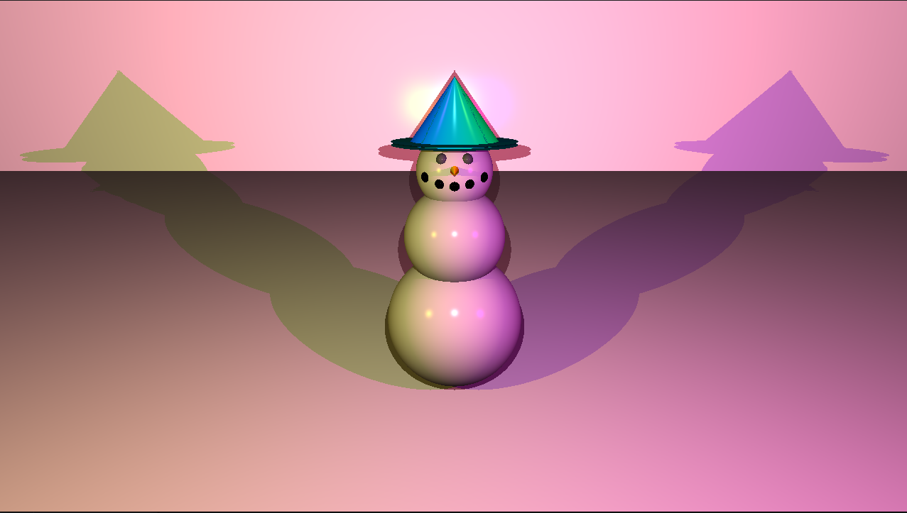
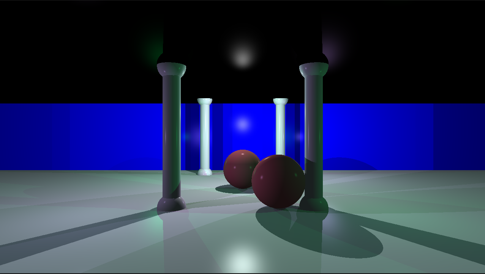
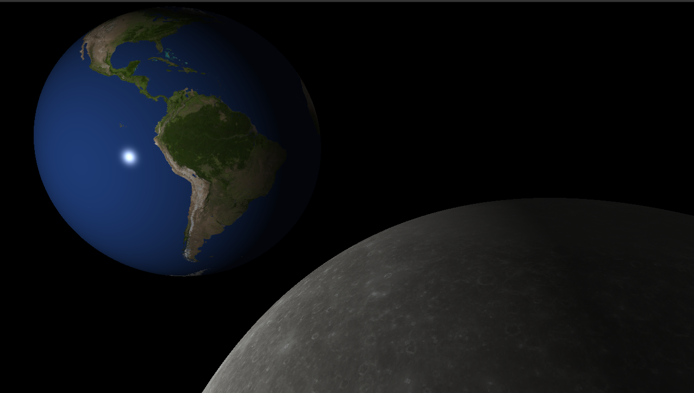
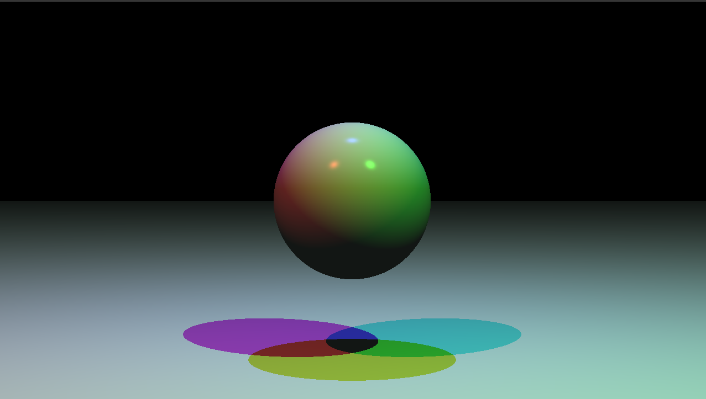

# miniRT

A minimalist ray-tracing engine built in C that renders simple 3D scenes.



## Overview

miniRT is a ray-tracing renderer that creates realistic 3D scenes from simple scene description files. It uses the mathematical principles of ray-tracing to generate images with realistic lighting, shadows, and reflections.

## Features

### Core Features
- Geometric primitives: spheres, planes, cylinders
- Multiple light sources with ambient lighting
- Phong reflection model (ambient, diffuse, and specular)
- Camera positioning with field of view control
- Simple material properties
- Anti-aliasing
- Scene loading from .rt configuration files
- Window management with minilibX

### Bonus Features
- **Phong Reflection Model**: Full implementation with specular highlights
- **Checkerboard Patterns**: Color disruption for more interesting surfaces
- **Enhanced Lighting**: Colored lights and multiple spotlights
- **Additional Objects**: Cone rendering
- **Bump Mapping**: Texture support with bump maps for realistic surface details

## Requirements

- macOS or Linux
- gcc compiler
- make
- minilibX graphics library

## Installation

1. Clone the repository:
   ```
   git clone https://github.com/yourusername/miniRT.git
   cd miniRT
   ```

2. Compile the program:
   ```
   make
   ```

## Usage

Run the program with a scene file:

```
./miniRT maps/scene.rt
```

## Scene Configuration

Scene files use the `.rt` extension and follow this format:

### Basic Elements

```
# Ambient light
A 0.2 255,255,255

# Camera
C -50,0,20 0,0,0 70

# Light
L -40,0,30 0.7 255,255,255

# Sphere
sp 0,0,20 20 255,0,0

# Plane
pl 0,0,0 0,1.0,0 255,255,255

# Cylinder
cy 50.0,0.0,20.6 0,0,1.0 14.2 21.42 10,0,255
```

## Implementation Details

### Ray-Tracing Algorithm

1. For each pixel in the output image:
   - Generate a ray from the camera through the pixel
   - Find the nearest object intersected by the ray
   - Calculate lighting at the intersection point
   - Determine the final color based on material properties and lighting

### Phong Reflection Model

The implementation uses the complete Phong reflection model with:
- Ambient component: Base lighting present throughout the scene
- Diffuse component: Light reflection based on surface orientation
- Specular component: Shiny highlights based on viewing angle

### Texture and Bump Mapping

- Checkerboard patterns are calculated based on world coordinates
- Bump mapping modifies the surface normal to create the illusion of texture

## Contributing

Contributions are welcome! Please feel free to submit a Pull Request.

## License

This project is licensed under the MIT License - see the LICENSE file for details.

## Examples




